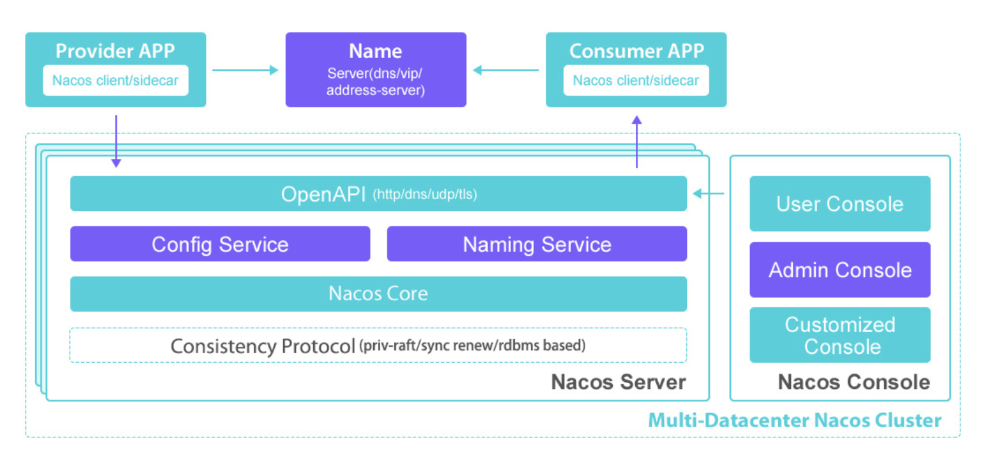
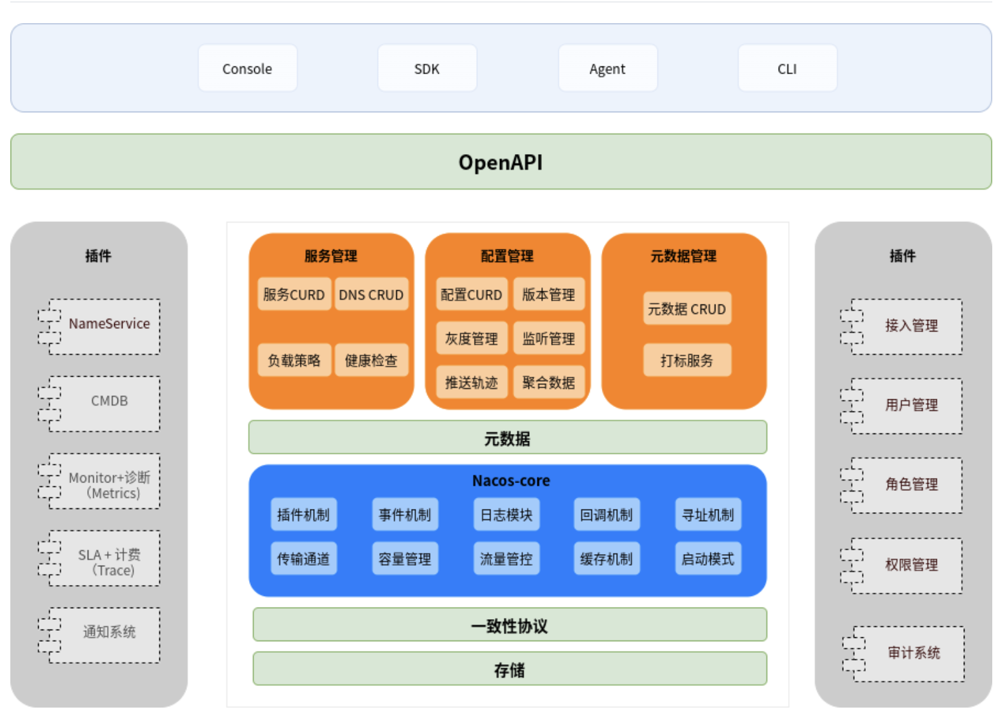
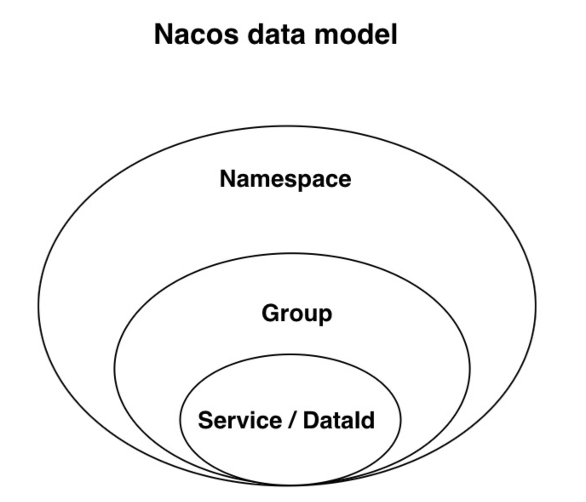
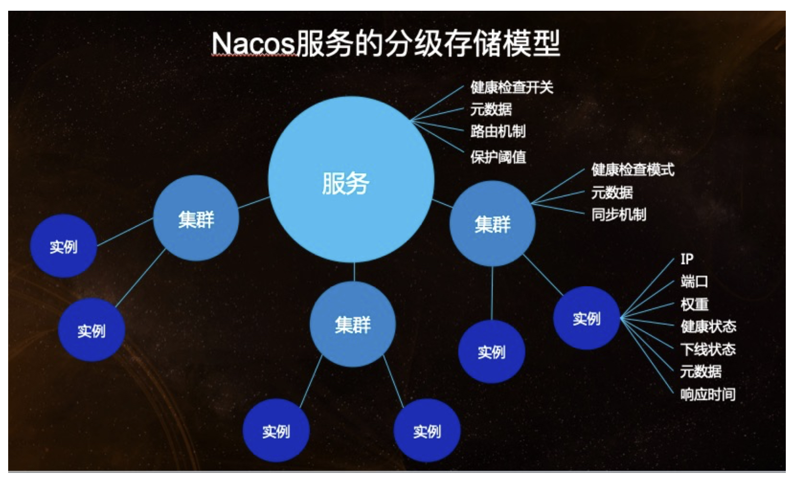
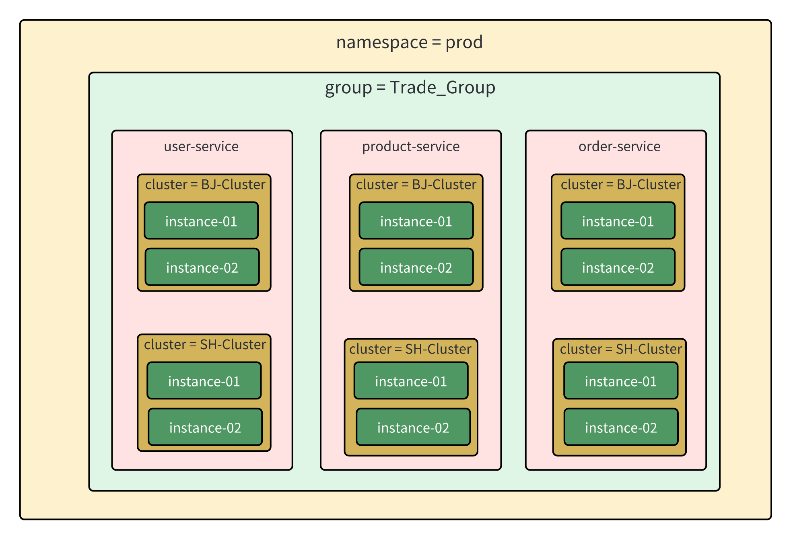
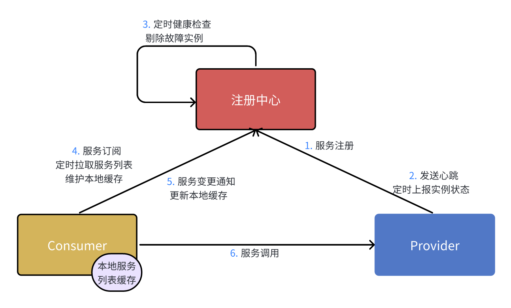
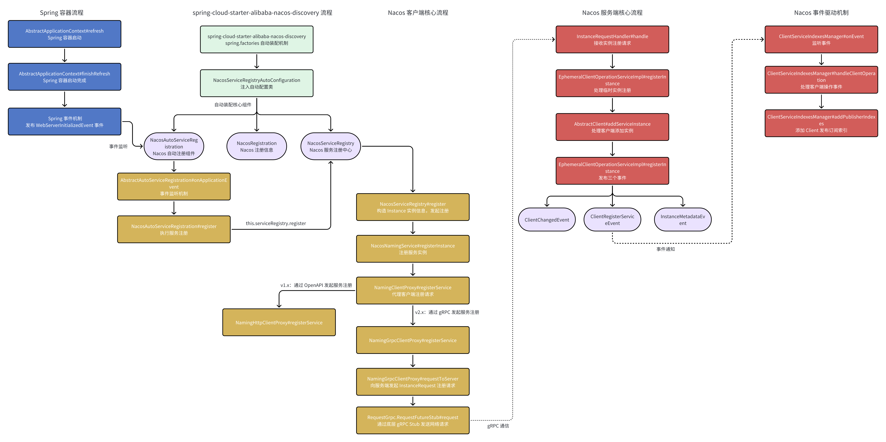
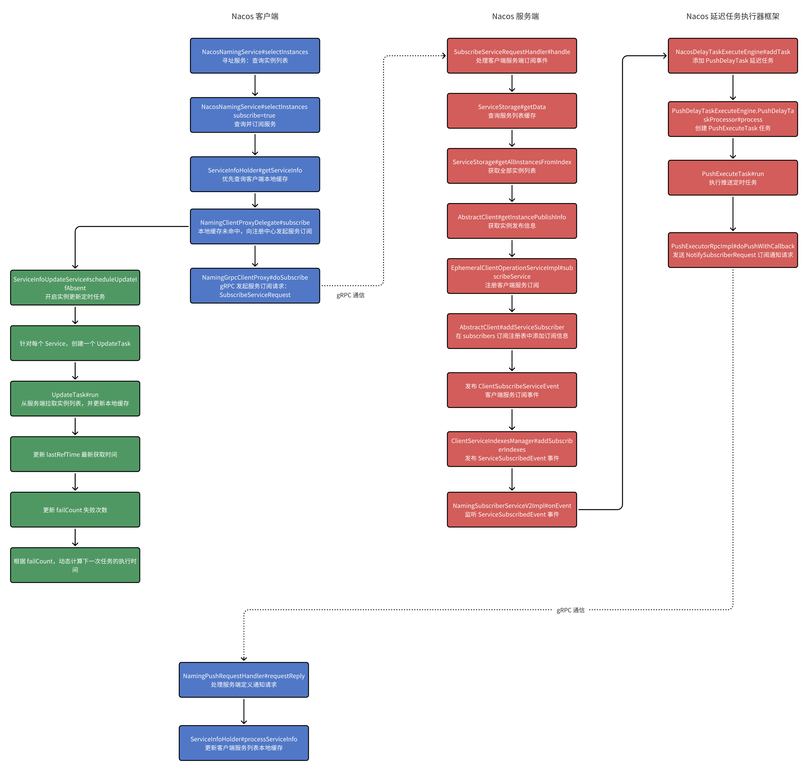

# 微服务技术体系实战

# 核心模块介绍

|          模块名          |          功能           |     备注     |
| :----------------------: | :---------------------: | :----------: |
| micro-service-dependency | 基于 BOM 的统一依赖管理 |              |
|    micro-service-api     |      服务接口定义       |              |
|       user-service       |       用户微服务        | 端口号：1001 |
|     product-service      |       商品微服务        | 端口号：2001 |
|      order-service       |       订单微服务        | 端口号：3001 |

# Spring Cloud Alibaba 版本说明

https://github.com/alibaba/spring-cloud-alibaba/wiki/%E7%89%88%E6%9C%AC%E8%AF%B4%E6%98%8E

# Nacos

## Nacos 整体架构



## Nacos 逻辑架构与组件



## 数据模型



## 服务领域模型



## 服务隔离最佳实践



### Namespace：命名空间——租户隔离/环境隔离

### Group：服务分组——业务隔离

### Service：服务的逻辑划分

### Cluster：集群——数据中心隔离/机房隔离

### Instance：具体的服务实例

## 微服务注册中心的核心功能



## 服务注册流程



## 服务订阅流程



## 心跳上报 & 健康检查流程


## Distro 协议原理

- **每个 Distro 节点都会负责一部分数据，节点自己处理这部分数据的写请求**
- **节点负责的数据发生变更时，会将变更异步同步到其他节点**
- **每个节点会定时将自己负责数据的 checksum 校验值发送到其他节点，以保证数据的最终一致性**
- **新加入集群的 Distro 节点，会从其它节点拉取全量数据，并保存在本地**

## Nacos 内部重要的注册表

- ServiceInfoHolder#serviceInfoMap：客户端的服务列表本地缓存
- AbstractClient#subscribers：服务端的服务订阅列表
- AbstractClient#publishers：服务端的服务通知列表，在服务发生变更时，会回调通知所有订阅的服务

## Nacos 注册中心的使用

### 1. 引入 Nacos 注册中心依赖

```XML
<!--Nacos服务注册中心-->
<dependency>
    <groupId>com.alibaba.cloud</groupId>
    <artifactId>spring-cloud-starter-alibaba-nacos-discovery</artifactId>
</dependency>
```

### 2. 在配置文件中指定注册中心地址

```YAML
spring:
  application:
    name: user-service
  cloud:
    nacos:
      #配置服务&配置中心地址
      server-addr: localhost:8848,localhost:8948,localhost:9048
      # Nacos注册中心配置
      discovery:
        namespace: 9874d759-858b-4564-a5af-81fb8bc02975
```

### 3. 服务启动时，会自动发起注册

## Nacos 配置中心的使用

### 2. 引入 Nacos 配置中心依赖

```XML
<!--Nacos配置中心-->
<dependency>
    <groupId>com.alibaba.cloud</groupId>
    <artifactId>spring-cloud-starter-alibaba-nacos-config</artifactId>
</dependency>
```

### 2. 引入 BootStrap 依赖

**引入 BootStrap 依赖，支持服务启动时优先加载 bootstrap.yml 配置文件。**

```XML
<!--BootStrap依赖,支持服务启动时优先加载bootstrap.yml配置文件-->
<dependency>
    <groupId>org.springframework.cloud</groupId>
    <artifactId>spring-cloud-starter-bootstrap</artifactId>
</dependency>
```

### 3. 创建 bootstrap.yml 配置，指定配置中心地址和配置文件列表

```YAML
spring:
  application:
    name: user-service
  cloud:
    nacos:
      #配置服务&配置中心地址
      server-addr: localhost:8848,localhost:8948,localhost:9048
      # Nacos注册中心配置
      discovery:
        namespace: 9874d759-858b-4564-a5af-81fb8bc02975

      # Nacos配置中心配置
      config:
        namespace: 9874d759-858b-4564-a5af-81fb8bc02975
        group: USER_SERVICE
        file-extension: yml
        extension-configs:
          - data-id: user-service-datasource.yml
            group: USER_SERVICE
            refresh: true
```

### 4. 在程序中加载配置，并使用 @RefreshScope 注解实现配置自动刷新。

```Java
/**
 * @author ZhangShenao
 * @date 2023/8/10 10:36 AM
 * @description: 数据源属性
 */
@Component
@RefreshScope   //属性动态刷新
public class DatasourceProperties {
    
    @Value("${datasource.name}")
    private String datasourceName;
    
    public String getDatasourceName() {
        return datasourceName;
    }
    
}
```

